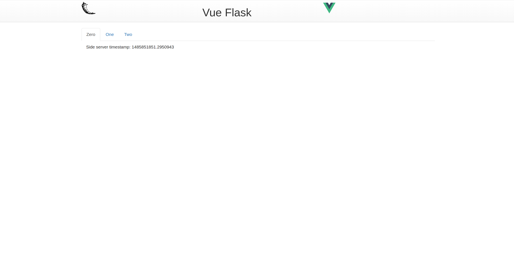

# Vue-Flask

Quick web Dashboard / REST API

## Stack

* Backend
    * Flask
    * Gunicorn

* Frontend
    * VueJS
    * Bootstrap

## Use

### Requirements

* npm
* python3
* virtualenv

#### Setup

    make
    
#### Testing
    
    
    make check
   
    
#### Gunicorn foreground
    
    
    make run
    
    
### Structure
    
    
    tree
    .
    |-- Makefile
    |-- README.md
    |-- app
    |   |-- __init__.py
    |   |-- api.py
    |   |-- static
    |   |   |-- Makefile
    |   |   |-- css
    |   |   |   `-- index.css
    |   |   |-- js
    |   |   |   `-- app.js
    |   |   |-- media
    |   |   |   |-- flask.png
    |   |   |   `-- vuejs.png
    |   |   `-- package.json
    |   |-- templates
    |   |   `-- index.html
    |   `-- tests
    |       |-- __init__.py
    |       `-- test_api.py
    |-- docs
    |   `-- preview.png
    `-- requirements.txt
    
    8 directories, 15 files
